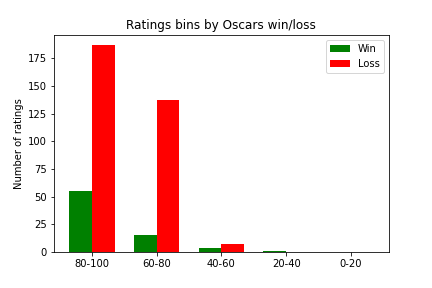

# Rotten Tomatoes Analysis Project
This project uses logistic regression models and statistical analysis methods to investigate the relationship between Rotten Tomatoes review scores and Oscar wins.

## Project Overview

### What data was used in this analysis?
[Rotten Tomatoes Dataset](https://www.kaggle.com/datasets/stefanoleone992/rotten-tomatoes-movies-and-critic-reviews-dataset?select=rotten_tomatoes_movies.csv)  

[Oscars Dataset](https://www.kaggle.com/datasets/unanimad/the-oscar-award)

### What questions does this analysis address? 
1. Historically, how well have rotten tomatoes critic scores correlated with “Best picture” Oscar wins? 
2. Historically, are rotten tomatoes ratings good predictors of wins in any category at the Oscars?

### What are the possible use cases for this analysis?
[Use Cases](https://github.com/Jonathan-Alexander/DATA515-RottenTomatoesAnalysis/blob/main/doc/functional_specification.md#use-cases)

### How do I re-run this pipeline? 
[How to Run the Pipeline](https://github.com/Jonathan-Alexander/DATA515-RottenTomatoesAnalysis/blob/main/examples/how_to_run_pipeline.md#how-to-run-the-pipeline)

### Where can I find the final analysis?
[Question 1](https://github.com/Jonathan-Alexander/DATA515-RottenTomatoesAnalysis/blob/main/rotten_tomatoes/q1_modeling.ipynb)  

[Question 2](https://github.com/Jonathan-Alexander/DATA515-RottenTomatoesAnalysis/blob/main/rotten_tomatoes/q2_modeling.ipynb)

## Results 
### Question 1:  
To find the answer to the question "Historically, how well have Rotten Tomatoes scores correlated with best picture Oscar wins?", we ran a simple logistic regression of critic rotten tomatoes score to best picture wins. When plotting the data, you see that many winning movies have low Oscar scores. 


It seemed like there might be an outlier issue, with even very popular movies getting low ratings from a few critics. For example, here are the critic ratings for the film "American Beauty", which won the best picture Oscar in 1999. 


So we decided to take the average of Rotten Tomatoes scores instead, which gave the following breakdown: 


In the first runs of the model, we noticed that the model was only ever predicting losses. Therefore, we increased the class weights to ensure that the model was predicting at least one Best Picture win. We ran some hyperparameter optimization to ensure that we were picking the class weights with the highest test accuracy. 

However, even with these improvements, our best any-win model coefficient was 0.023. When the model was allowed to predict no wins, its regression coefficient was 0.028. This tells us that Rotten Tomatoes critic score is not a strong predictor of a Best Picture Oscars win. 

The highest any-win model test accuracy we saw was 83.3%, while the no-win model was 84.3%. This tells us that predicting no wins at all leads to higher performance with this model architecture. 

To improve these results, you might need to choose a more complicated model than logistic regression, or add in other explanatory variables. 

### Question 2:

## Ideas for Future Work
The analysis contained in this repository only scratches the surface of what can be discovered with this data. Here are some potential questions for future research:
 * Which Oscar award most strongly correlates with Rotten Tomatoes scores?
 * Is there an interaction effect between genre and Rotten Tomatoes score on Oscar wins?
 * How closely do audience scores correlate with critic scores?
 * Historically, which critics have most accurately predicted Oscar success?
 * How do outside factors (budget, box office sales, etc.) affect Oscar win probability?


## File Structure

```
.
├── data
|   ├── rotten_tomatoes_critic_reviews.csv
|   ├── rotten_tomatoes_movies.csv
|   ├── the_oscar_award.csv
|   ├── best_picture_data.csv
|   └── any_win_data.csv
├── doc
|   ├── img
|       ├── Data_Flow_Pipeline.png
|   ├── component_specification.md
|   ├── functional_specification.md
|   └── milestones.md
├── examples
|   ├── how_to_run_pipeline.md
├── images
|   ├── american_beauty_scores.png
|   ├── heatmap.png
|   ├── oscar_success_review_score_fit.png
|   ├── oscar_wins_review_score_fit.png
|   ├── ratings_bins_all.png
|   ├── ratings_bins_average.png
├── rotten_tomatoes
|   ├── utils
|       ├── __init__.py
|       ├── data_cleaning.py
|       ├── data_download.py
|       ├── regression.py
|   ├── data_cleaning.py
|   ├── data_download.py
|   ├── q1_modeling.ipynb
|   ├── q2_modeling.ipynb
|   └── __init__.py
├── tests
|   ├── test_data_cleaning.py
|   ├── test_data_download.py
|   └── test_utils.py
├── LICENSE
└── README.md
└── setup.py
└── .gitignore
└── environment.yml
└── __init__.py
└── .coveragerc
```


