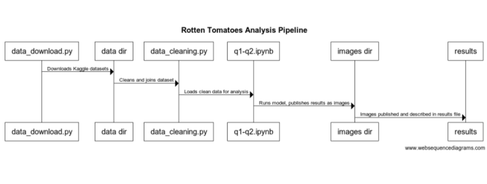

# Component specification

## Component 1

### Name:

rotten_tomatoes/utils.py

### What it does:

Contains central functions used in pipeline, which then can be more easily unit-tested.

### Inputs:

None

### Outputs:

Exports a set of central functions

### Assumptions:

None

## Component 2

### Name:

rotten_tomatoes/data_download.py

### What it does:

Downloads three publicly-available datasets into the “data” folder.

### Inputs:

None

### Outputs:

- rotten_tomatoes_critic_reviews.csv
- rotten_tomatoes_movies.csv
- the_oscar_award.csv

### Assumptions:

- The file is being called from the root of the repository

## Component 3

### Name:

rotten_tomatoes/data_cleaning.py

### What it does:

Reads in the three datasets produced by data_download.py, cleans, and merges them.
It includes inline comments to explain the cleaning process to more technical users.

### Inputs:

- rotten_tomatoes_critic_reviews.csv
- rotten_tomatoes_movies.csv
- the_oscar_award.csv

### Outputs:

- any_win_data.csv
- best_picture_data.csv

### Assumptions:

- The file is being called from the root of the repository
- data_download.py has already been run.

## Component 4

### Name:

rotten_tomatoes/q1_modeling.ipynb

### What it does:

Reads in the prepared dataset from data_cleaning.py, and creates a logistic regression model to answer research question 1.

### Inputs:

- best_picture_data.csv

### Outputs:

Images to the images/ folder that will be used in Results pdf

### Assumptions:

- The file is being called from the root of the repository
- data_cleaning.py has already been run.

## Component 5

### Name:

rotten_tomatoes/q2_modeling.ipynb

### What it does:

Reads in the prepared dataset from data_cleaning.py, and creates a logistic regression model to answer research question 2.

### Inputs:

- any_win_data.csv
- best_picture_data.csv

### Outputs:

Images to the images/ folder that will be used in Results pdf

### Assumptions:

- The file is being called from the root of the repository
- data_cleaning.py has already been run.

## Component 6

### Name:

Results.pdf

### What it does:

- Contains modeling results from two modeling notebooks
- Contains ideas for further analysis

### Inputs:

Images from the images/ folder, produced by modeling scripts

### Outputs:

None

### Assumptions:

- The expected files are in the images/ folder.

## Component 7

### Name:

README.md

### What it does:

- Shows a high-level table of contents for the repository
- Instructs the user where to navigate to find the results they want

### Inputs:

None

### Outputs:

None

### Assumptions:

None

## Component 8

### Name:

How_to_run_Pipeline.md

### What it does:

- Instructs the user how to run the pipeline for a new (more recent), and similar dataset

### Inputs:

Images from the doc/img folder

### Outputs:

None

### Assumptions:

- The expected files are in the doc/img folder
- User has technical background (Maintainer User Story)

---

## Data Flow/Pipeline

## Please reference this markdown file for project milestones: [Milestones](milestones.md)
